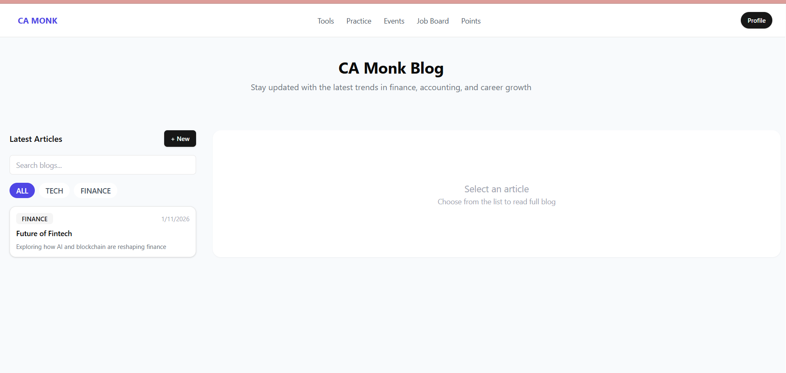
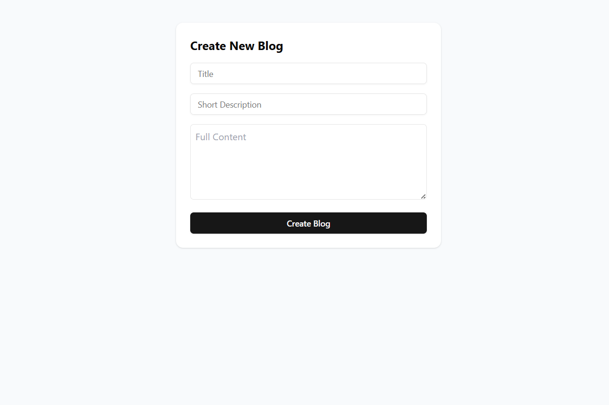

# -Frontend-Interview
CA Monk - Blog Application Assignment
Welcome to the **CA Monk Blog Application Assignment**!  
This project evaluates your ability to build a modern React application using server-state management, component libraries, and responsive UI.

---

# Tech Stack

| Category | Technology |

| Frontend | React + TypeScript |
| Styling | Tailwind CSS |
| UI Library | shadcn/ui |
| Server State | TanStack Query |
| Backend (Mock) | JSON Server |
| Routing | React Router |

# Features Implemented

```bash
 1.Fetch all blogs (GET /blogs)  
 2.View blog by ID (GET /blogs/:id)  
 3.Create new blog (POST /blogs)  
 4.Search by title  
 5.Filter by category  
 6.Master–detail layout (Left list, Right detail)  
 7.URL based blog selection  
 8.Responsive UI (mobile + desktop)  
 9.Loading & error states  
 10.Cache invalidation after create 
```
# Step 1: Install Node.js

Download and install Node.js (v18 or higher):

```bash
:- https://nodejs.org
```

# Step 2:Open terminal and run:

```bash
├─ cd camonk-blog
 ```

# Step 3: Install Project Dependencies

```bash
├─ npm install
    
      └─ This will install all required packages like React, Tailwind, TanStack Query, and shadcn/ui.
 ```

# Step 4: Project Structure


# Step 5: Start Frontend Server

Open a new terminal window and run:

    └─ npm run dev

 ** Optional Commands **

If port 3000 is already in use:

```bash
npx json-server db.json --port 3001
```

**Then update API URL in**

src/api/blogs.ts

```bash
baseURL: "http://localhost:3001"
 ``` 

# Step 6: Open Application in Browser

Browser me open karo:

```bash
http://localhost:5173
```

# **Expected Output**

```bash
Left side: Blog List

Right side: Blog Details

Search bar on top

Category filter buttons

"+ New" button to create blog
```

 # **Take Screenshots**

Run app and take screenshots of:

1. Home Page (Blog List & Detail View)



2. Create Blog Page



3. footer Detail View


